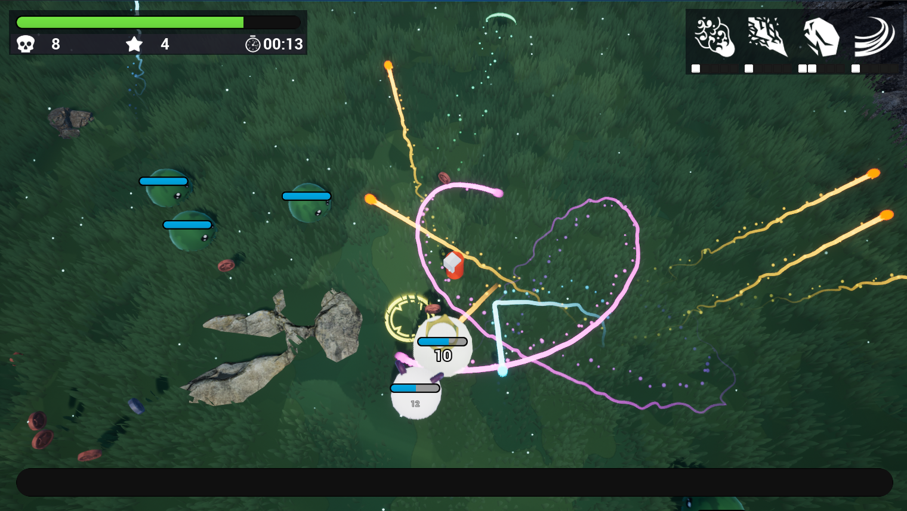

# Survive 10min

## 项目简介

**Survive 10min** 是一个基于 **Unreal Engine 5 蓝图**开发的类《吸血鬼幸存者》游戏 demo，用于校招 / 实习面试展示。

该项目以“**10 分钟生存**”为核心目标，围绕角色生存、敌人追踪、法术攻击、经验成长和技能升级，完成了一个可运行、可演示的核心玩法闭环。

## 项目亮点

- 基于 **UE5 Blueprint** 完成类幸存者游戏核心玩法开发；
- 实现了生存计时、敌人生成与追踪、法术攻击、经验升级等关键系统；
- 使用 **Blender** 制作部分游戏资产，并完成贴图、导入与场景集成；
- 在约 **1 个月** 内完成从学习、复现到可演示版本的开发。

## 已实现功能

### 核心玩法

- **10 分钟生存机制**：玩家需要在地图中尽可能生存更久，敌人强度会随时间推进逐步提升；
- **技能升级系统**：玩家升级后可以学习新的法术或强化已有法术；
- **经验成长系统**：通过击败敌人并拾取掉落物获取经验，提升角色等级。

### 玩家系统

- **基础移动**：实现玩家 WASD 移动；
- **基础攻击**：实现法术生成、攻击判定与伤害结算；
- **升级反馈**：角色升级后可进入技能选择与成长流程。

### 敌人系统

- **敌人多样性**：设计多个不同类别的史莱姆敌人，并配置不同生命值和伤害；
- **自动追踪与攻击**：敌人会自动靠近玩家并造成伤害；
- **强度成长**：敌人会随着时间推进变得更具威胁。

### 法术系统

- **法术多样性**：设计多种攻击方式不同的法术；
- **法术升级**：法术升级后可进一步提升效果与战斗能力。

### 资源与场景

- **主关卡场景搭建**；
- **部分游戏资产制作**：包括金币、敌人、法术等资产的建模、贴图与导入；
- **基础视觉效果实现**：包括材质表现与部分粒子特效。

## 技术栈

- **Unreal Engine 5**
    - **Blueprint 蓝图系统**：实现游戏主要逻辑；
    - **Material 材质系统**：实现材质表现与部分视觉效果；
    - **Niagara 粒子系统**：实现部分粒子特效；
- **Blender**：用于部分游戏资产建模、贴图与烘焙；
- **Sketchfab**：参考或获取部分免费三维资源；
- [**Game-icons.net**](http://game-icons.net/)：使用部分免费图标资源；
- **无缝纹理贴图工具**：https://www.imgonline.com.ua/eng/make-seamless-texture.php

## 演示视频

[待补充]

## 参考

### 相似游戏参考

- 《Vampire Survivors》https://store.steampowered.com/app/1794680/Vampire_Survivors/
- 《Brotato》https://store.steampowered.com/app/1942280/Brotato/

### 课程参考

- **UE5 + Blender 复刻《吸血鬼幸存者》：零基础打造 3D 割草爽游**https://www.bilibili.com/video/BV1Srv6BJEPD?spm_id_from=333.788.videopod.sections&vd_source=142aa0ad8c39432f265ed396e1d89a27
- Udemy 原课程链接 https://www.udemy.com/course/how-to-make-your-first-game-with-blender-and-unreal-engine-5/